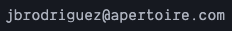

# Purpose

This script retrieves control data from an unRAID server, in order to troubleshoot issues in a simulated development environment.

To protect users privacy it strips sensitive data (registration info, disks serial nr, etc).

# Instructions

You need to access the server's console in order to execute the script.

Either ssh or telnet into the server and type the following commands:

```bash
$ cd /boot
$ curl -fsSL -o support https://raw.githubusercontent.com/jbrodriguez/controlr-support/master/support
$ chmod +x support
$ ./support
```

It will prompt for your server (you can enter localhost here), the port and the root password (if you have set it, if you didn’t just press enter).

This will create a /boot/controlr.zip file that you can email to the support address 

# Additional note

The sensitive data that will be removed are lines that begin with

*   regFILE=
*   regGUID=
*   regTy=
*   regTo=
*   regTm=
*   regTm2=
*   regGen=
*   flashGUID=
*   flashProduct=
*   flashVendor=

and serial ids of your disks
